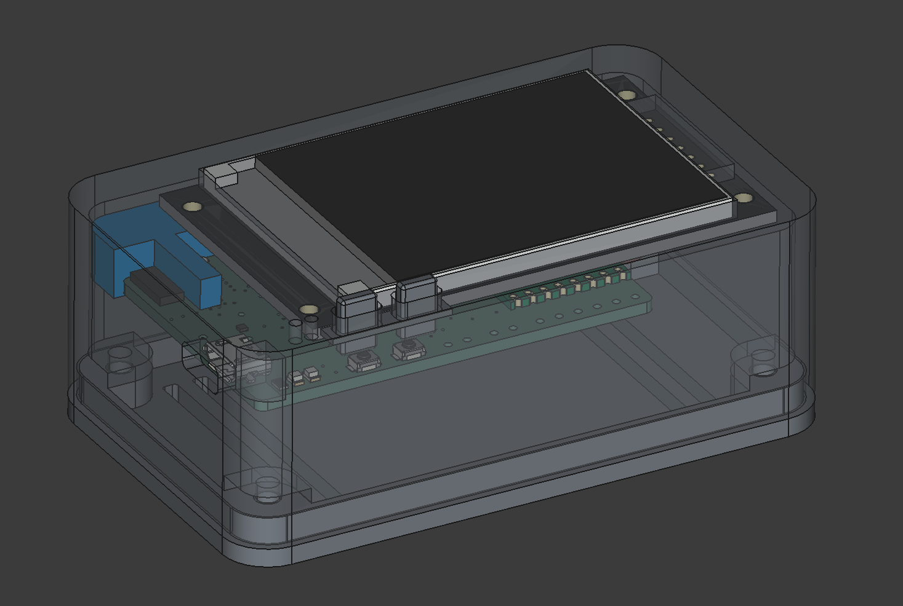

# co2Tracker Case

This folder contains the FreeCAD design files and exported assets for the enclosure of the co2Tracker device.

## Contents

- **FreeCAD Project:**  
  - `co2Tracker_case.FCStd` — Main editable FreeCAD file for the enclosure design.

- **Exports:**  
  - `co2Tracker_case_Top.stl` — STL file for the top part of the case.
  - `co2Tracker_case_Bottom.stl` — STL file for the bottom part of the case.
  - `co2Tracker_case_Board_spacer.stl` — Spacer for mounting the board.
  - `co2Tracker_case_Buttons_extender.stl` — Extender for external buttons.

## Description

The case is designed to fit the IoT-PostBox board, SCD30 sensor, GPS module, TFT display, and battery.  
It provides protection and mounting points for all components, with cutouts for the display, connectors, and ventilation for the CO₂ sensor.

**Rear Features:**  
- Holes for mounting the LoRa antenna  
- Cutout for a switch to activate the battery  
- Opening for routing the cable of the external GPS module

**Parametric Design:**  
The enclosure is fully parametric and can be easily modified by adjusting the variable table in the FreeCAD spreadsheet. This allows you to adapt the case to different hardware layouts or dimensions.

**Assembly:**  
- Requires 4x M3x5mm screws for mounting.